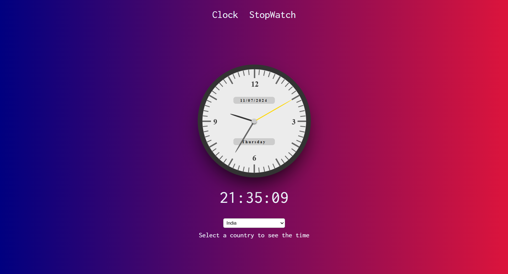
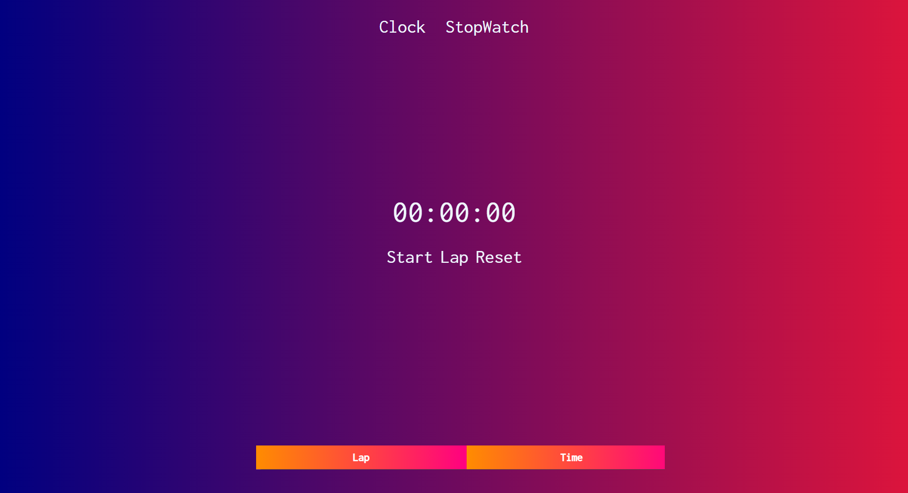
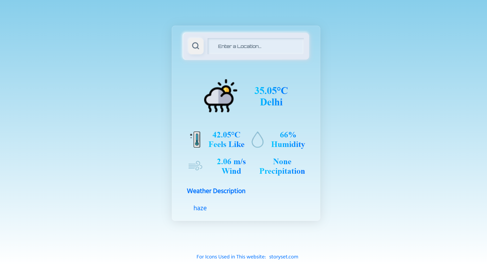
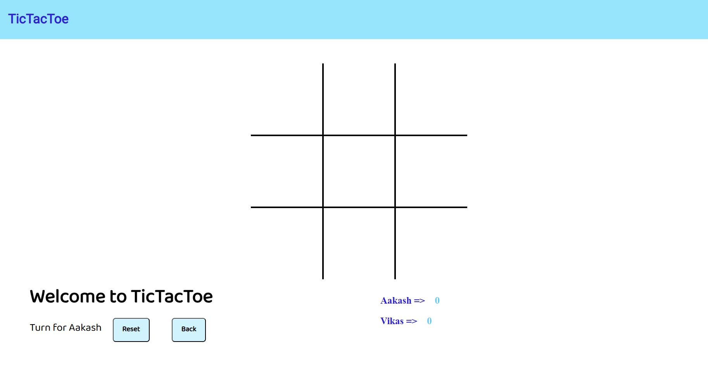

# Internship Projects Repository

Welcome to my internship projects repository! This repository contains four projects that I developed during my internship. Below, you'll find descriptions and instructions for each project.

## Table of Contents
1. [Responsive Landing Page](#responsive-landing-page)
2. [Stopwatch](#stopwatch)
3. [Weather App](#weather-app)
4. [Tic Tac Toe](#tic-tac-toe)

## Responsive Landing Page

### Description
A fully responsive landing page designed to adapt to different screen sizes, providing an optimal viewing experience on devices ranging from mobile phones to desktops.

### Features
- Responsive design
- Smooth scrolling
- Interactive navigation menu
- Modern UI/UX design

### Screenshot


### Technologies Used
- HTML
- CSS
- JavaScript

### How to Run
1. Clone the repository:
    ```sh
    git clone https://github.com/vanshs2022/Prasunet_WD_01.git
    ```
2. Navigate to the `responsive-landing-page` directory:
    ```sh
    cd vanshs2022/responsive-landing-page
    ```
3. Open `index.html` in your browser.

## Stopwatch

### Description
A digital stopwatch application that allows users to start, stop, pause, and reset time with a user-friendly interface.

### Features
- Start, stop, and reset functionality
- Lap recording
- Responsive design

### Screenshot



### Technologies Used
- HTML
- CSS
- JavaScript

### How to Run
1. Navigate to the `stopwatch` directory:
    ```sh
    cd vanshs2022/stopwatch
    ```
2. Open `index.html` in your browser.

## Weather App

### Description
A weather application that provides real-time weather information for any city using the OpenWeatherMap API.

### Features
- Fetches and displays current weather data
- Responsive design
- Dynamic background images based on weather conditions

### Screenshot


### Technologies Used
- HTML
- CSS
- JavaScript
- OpenWeatherMap API

### How to Run
1. Navigate to the `weather-app` directory:
    ```sh
    cd vanshs2022/weather-app
    ```
2. Open `index.html` in your browser.

## Tic Tac Toe

### Description
A classic Tic Tac Toe game where two players can play against each other. The game checks for winning conditions and highlights the winning combination.

### Features
- Two-player functionality
- Winning combination highlighting
- Responsive design

### Screenshot


### Technologies Used
- HTML
- CSS
- JavaScript

### How to Run
1. Navigate to the `tic-tac-toe` directory:
    ```sh
    cd vanshs2022/tic-tac-toe
    ```
2. Open `index.html` in your browser.

Thank you for checking out my projects!
